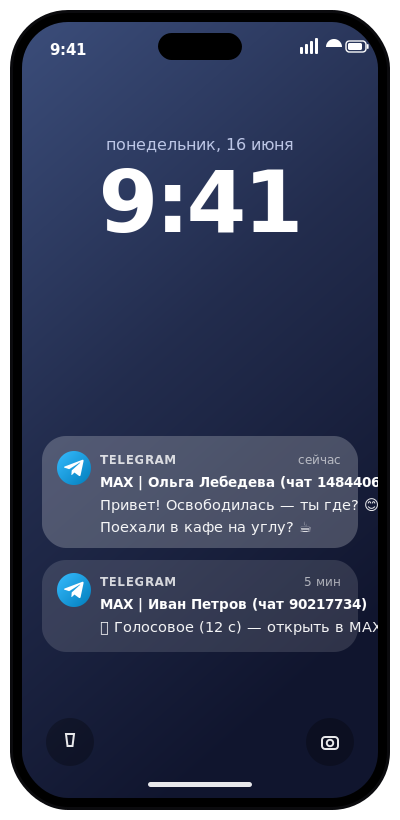
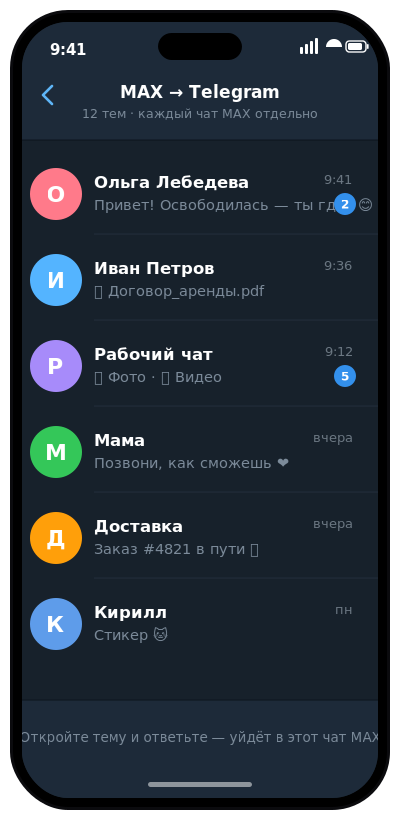
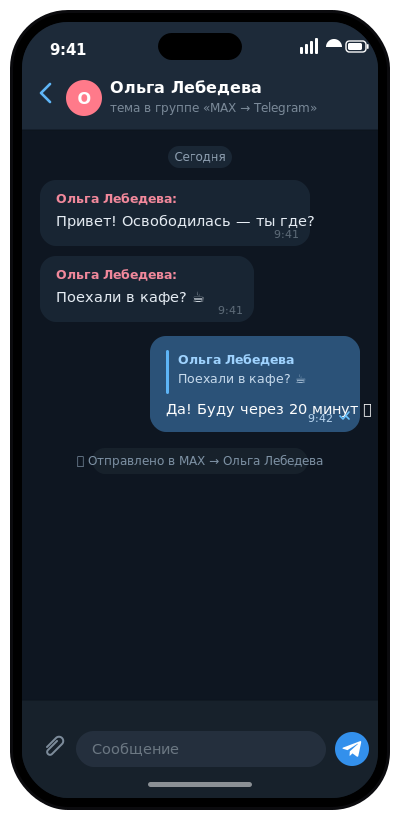

<h1 align="center">MAX&nbsp;→&nbsp;Telegram&nbsp;🚀</h1>

<p align="center">
  
</p>

<p align="center">
  <b>Весь ваш MAX — в Telegram. С пушами, голосовыми и ответом в один свайп.</b>
</p>

<p align="center">
  🔔 уведомления&nbsp;·&nbsp;↔️ двусторонний&nbsp;·&nbsp;🎤 голосовые в обе стороны&nbsp;·&nbsp;🔄 правки/реакции вживую&nbsp;·&nbsp;🗂 тема на каждый чат&nbsp;·&nbsp;🔒 self-hosted&nbsp;·&nbsp;🆓 бесплатно
</p>

<p align="center">
  <a href="https://github.com/Sillkiin/max2tg/actions/workflows/ci-docker.yml"></a>
  
  
  <a href="https://github.com/Sillkiin/max2tg/pkgs/container/max2tg"></a>
  <a href="LICENSE"></a>
</p>

<p align="center">
  <a href="#-быстрый-старт"><b>⚡ Запустить за 5 минут</b></a>
  &nbsp;·&nbsp; <a href="#-что-умеет">Возможности</a>
  &nbsp;·&nbsp; <a href="#-режим-тем">Режим тем</a>
  &nbsp;·&nbsp; 🇬🇧 <a href="#-in-english">In English</a>
</p>

---

<p align="center">
  <b>Мессенджер MAX неудобен, а на iPhone его вообще нет в App Store.</b><br>
  <code>max2tg</code> зеркалит ваш аккаунт <b>MAX (max.ru)</b> в <b>Telegram</b> — целиком и в обе стороны.<br>
  Сообщения, медиа, стикеры и даже <b>голосовые</b> прилетают в привычный Telegram с нормальными
  уведомлениями. Отвечаете прямо оттуда — свайп, и сообщение уходит в нужный чат MAX.<br>
  <b>Никаких чужих серверов: всё крутится у вас.</b>
</p>

---

##  Для iPhone / iPad — это **единственный** рабочий способ

**MAX удалён из App Store.** Официально на iOS его не поставить и нормально не попользоваться.
`max2tg` это решает — раз и навсегда:

|  | 🚫 MAX на iPhone «как есть» | ✅ С `max2tg` |
|---|---|---|
| **Установка** | в App Store нет | ничего ставить не надо — у вас уже есть Telegram |
| **Уведомления** | нет пушей | 🔔 обычные пуши Telegram |
| **Чтение/ответы** | нечем | 💬 поиск, темы, ответ свайпом |
| **Голосовые** | не послушать | ▶️ играют прямо в чате |

<p align="center">
  
  &nbsp;
  
  &nbsp;
  
</p>
<p align="center">
  <sub><b>1.</b> пуши из MAX на локскрине iPhone&nbsp;·&nbsp;<b>2.</b> каждый чат — отдельная тема&nbsp;·&nbsp;<b>3.</b> ответ из Telegram уходит обратно в MAX&nbsp;&nbsp;<i>(макеты)</i></sub>
</p>

---

## ✨ Что умеет

### Хедлайнеры

- 🎤 **Голосовые в обе стороны** &nbsp;`NEW`&nbsp; — из MAX **играют** прямо в Telegram, а ваши
  голосовые из Telegram приходят в MAX **настоящим** голосовым (волна + длительность).
  *Этого не умеет даже веб-клиент MAX* — раскопали в протоколе мобильного приложения.
- 🔄 **Правки · удаления · реакции — вживую** &nbsp;`NEW`&nbsp; — отредактировали, удалили или
  поставили реакцию в одном мессенджере → мгновенно видно в другом. В **обе** стороны.
- 🗑 **`/del` — удалить у всех** &nbsp;`NEW`&nbsp; — передумали? Ответьте `/del` на своё сообщение —
  и оно исчезнет **у собеседника** в MAX.
- 🗂 **Тема на каждый чат** — форум Telegram: каждый диалог MAX = отдельная тема с именем собеседника.
- 🎮 **Управление из Telegram** — `/dm` написать человеку по номеру, `/join` вступить в канал.

### Всё остальное

| | |
|---|---|
| 🔔 **Уведомления** | пуши о новых сообщениях MAX — как обычные уведомления Telegram |
| ↔️ **Двусторонний** | не пересылка, а полноценный диалог: отвечаете из Telegram — уходит в MAX |
| 🖼 **Медиа** | фото, видео, файлы, стикеры, GIF — в обе стороны |
| ↪️ **Пересланное** | разворачивает реальный текст/медиа, а не пустую «Отправитель:» |
| 🔒 **Приватно** | токены и переписка остаются у вас; ничего не уходит на чужие серверы |
| 🆓 **Бесплатно** | без подписок, открытый код (MIT) |
| 🖥 **Где угодно** | Windows, старый Android (Termux) или сервер 24/7 (Docker) |
| ✅ **Надёжно** | 478 авто-тестов, ~88% покрытие, CI на каждый коммит |

**Что именно передаётся:**

| Направление | Содержимое |
|---|---|
| **MAX → Telegram** | текст · фото · видео · файлы · стикеры · **голосовые (играют)** · **правки · удаления · реакции** |
| **Telegram → MAX** | текст · фото · видео · файлы · **нативные голосовые** · **правки · реакции** · удаление через `/del` |

---

## ⚡ Быстрый старт

**Windows, ~5 минут.** Запустите **`run.bat`** — мастер настройки попросит три вещи:

**1. Токен Telegram-бота**
Создайте бота у [@BotFather](https://t.me/BotFather) командой `/newbot` и скопируйте токен.

**2. `/start` вашему боту**
Напишите боту `/start`, чтобы мост узнал, куда слать сообщения.

**3. Токен MAX**
Войдите на [web.max.ru](https://web.max.ru), нажмите `F12` → вкладка **Console**, выполните
команду и вставьте результат в мастер:

```js
copy(JSON.parse(localStorage.__oneme_auth).token)
```

> ⚠️ **Не нажимайте «Выйти» (Logout)** в web.max.ru — это аннулирует токен. Просто закройте
> вкладку. Токен хранится локально в `config.json`.

**Готово ✅** Это базовый режим — все сообщения MAX в одной личке с ботом. Дальше включите
[режим тем](#-режим-тем) — так в разы удобнее. 👇

---

## 🗂 Режим тем

Чтобы каждый MAX-чат стал **отдельной темой** Telegram-форума, а не сваливался в одну ленту:

1. Создайте **Telegram-супергруппу** и включите в настройках **«Темы» (Topics)**.
2. **Добавьте бота** в группу, дайте права **администратора** с разрешением **«Управление темами»**
   — без этого мост не создаст темы.
3. Узнайте **id группы** (начинается с `-100…`, например через [@getidsbot](https://t.me/getidsbot))
   и пропишите в `config.json`:

```json
{
  "telegram_topics_enabled": true,
  "telegram_forum_chat_id": -1001234567890,
  "telegram_preload_topics": true,
  "telegram_seed_last_messages": true,
  "telegram_confirm_sent": false
}
```

Каждый MAX-чат получит свою тему с именем собеседника. Пишете в теме — уходит в этот чат MAX;
**Reply** (свайп) отправляет ответ цитатой.

---

## 🎮 Команды

Ботом можно **управлять MAX прямо из Telegram** — команды видны в меню по «/»:

| Команда | Что делает |
|---|---|
| `/dm <телефон или id> <текст>` | **Написать человеку.** Найду по номеру и напишу; его ответ придёт отдельной темой. |
| `/join <ссылка или @username>` | **Вступить в канал / группу / чат.** Появится отдельной темой. |
| `/del` (ответом на своё) | **Удалить своё сообщение у всех в MAX.** Ответьте `/del` (или `/delete`) на отправленное вами сообщение в теме — оно исчезнет у собеседника. |
| `/help` · `/start` | Справка и приветствие. |

Просто: **люди — `/dm` по телефону, каналы — `/join` по ссылке, удалить своё — `/del` ответом.**

```
/dm +79991234567 привет            # написать человеку по телефону
/join https://max.ru/join/AbCdEf   # вступить в канал/чат по ссылке (или просто пришлите ссылку)
```

> ℹ️ **Ответить в существующий чат** — `Reply` (свайп) на пересланном сообщении: уйдёт точно туда.
> Поиск каналов по **названию** MAX не поддерживает — только по ссылке/@нику.

---

## 🌐 Сервер 24/7

Мост держит постоянное соединение, поэтому ему нужен хост, который **не «засыпает»**
(обычные бесплатные «спящие» PaaS не подойдут).

| Где | Как |
|---|---|
| 🖥 **Windows** | `run.bat` + автозапуск через `shell:startup` |
| 📟 **Старый Android** | [Termux](https://f-droid.org/packages/com.termux/) — мини-сервер с российским IP |
| ☁️ **Сервер (Docker)** | готовый образ из GHCR, без исходников ↓ |

**Готовый Docker-образ — нужны только два файла:**

```bash
mkdir max2tg && cd max2tg
curl -O https://raw.githubusercontent.com/Sillkiin/max2tg/main/docker-compose.yml
curl -o .env https://raw.githubusercontent.com/Sillkiin/max2tg/main/.env.example
nano .env                 # три значения MAX2TG_* (свежий токен MAX!)
docker compose up -d      # подтянет ghcr.io/sillkiin/max2tg:latest
```

Обновление позже: `docker compose pull && docker compose up -d`.
Полный гайд (Oracle Cloud, прокси, systemd) — в **[DEPLOY.md](DEPLOY.md)**.

---

## ❓ Вопросы и ответы

<details>
<summary><b>Канал шлёт слишком много уведомлений — как заглушить?</b></summary>

<br>Заглушите <b>тему</b> штатными средствами Telegram: долгий тап по теме в списке →
<b>«Выключить уведомления»</b>. В форуме глушится <b>каждая тема отдельно</b> — каналам выключите,
людям оставите. Это полностью убирает и звук, и баннер.
</details>

<details>
<summary><b>Темы пересоздаются после каждого перезапуска</b></summary>

<br>Значит не сохраняется <code>state.json</code> (карта «MAX-чат → тема»). В Docker он лежит на
постоянном томе; путь задаётся через <code>MAX2TG_STATE_PATH</code>. Без Docker файл хранится рядом со скриптами.
</details>

<details>
<summary><b>Как убрать «✅ Отправлено в MAX» после каждого ответа</b></summary>

<br>Добавьте в <code>config.json</code>: <code>"telegram_confirm_sent": false</code>. Ошибки отправки
при этом всё равно показываются.
</details>

<details>
<summary><b>Мост пишет, что токен MAX устарел</b></summary>

<br>Получите свежий токен на <a href="https://web.max.ru">web.max.ru</a> (та же команда в консоли)
и обновите его в <code>config.json</code> или <code>.env</code>, затем перезапустите мост.
</details>

---

## ⚖️ Ограничения

- ⚙️ **Неофициальный API MAX** (через [vkmax](https://github.com/nsdkinx/vkmax) — официального API
  для личных аккаунтов нет). Для MAX это выглядит как вход через веб-версию; теоретически он может
  ограничить сессию.
- 🎤 **Голосовые** работают через **недокументированный** аудио-эндпоинт MAX (разобран из приложений)
  — если MAX его поменяет, понадобится правка.
- 📦 **Файлы и видео до ~50 МБ** (лимит Telegram-ботов); крупнее — уведомление «открыть в MAX».
- 🔑 **Токены** лежат локально в `config.json` (в `.gitignore`, не коммитятся).

---

## 🛠 Для разработчиков

<details>
<summary>Структура проекта и сборка</summary>

<br>

| Файл | Назначение |
|------|------------|
| `main.py` / `setup_wizard.py` | точка входа и мастер настройки |
| `bridge.py` | ядро: слушает MAX, маршрутизирует, принимает ответы |
| `max_client.py` | WebSocket-клиент MAX (браузерные заголовки, вход по токену) |
| `attaches.py` / `mediamax.py` | разбор и загрузка медиа MAX (фото/видео/файлы/голосовые) |
| `maxmsg.py` | правки / удаления / реакции в MAX (опкоды 66/67/178/179) |
| `tg.py` | мини-клиент Telegram Bot API |
| `state.py` / `config.py` | карта тем и конфигурация |
| `Dockerfile` / `docker-compose*.yml` / `DEPLOY.md` | деплой |

```bash
python -m unittest discover -s tests     # 478 тестов, ~88% покрытие
```

CI (GitHub Actions) на каждый push в `main` гоняет тесты и публикует Docker-образ
`ghcr.io/sillkiin/max2tg:latest`. Локальная сборка из исходников:
`docker compose -f docker-compose.build.yml up -d --build`.
</details>

---

## 🇬🇧 In English

<details>
<summary>Click to expand</summary>

<br><b>max2tg</b> mirrors your personal <b>MAX</b> (max.ru) messenger into <b>Telegram</b> — both ways —
and lets you reply from there.

>  <b>MAX is gone from the App Store.</b> You can't install it
> on iPhone/iPad anymore. max2tg brings every MAX chat into <b>Telegram</b> (which you already have)
> <b>with normal push notifications</b> — effectively the only way to use MAX on iOS.

- **Two-way.** Incoming MAX messages — text, photos, videos, files, stickers, **voice** — are
  forwarded to Telegram; reply right from Telegram and it lands in the MAX chat.
- **Voice both ways & live sync.** MAX voice **plays** in Telegram and Telegram voice notes arrive in
  MAX as a **native** voice message; **edits, deletions and reactions mirror both ways**.
- **Topics.** Each MAX chat becomes its own Telegram forum topic, named after the contact.
- **Commands** (in the "/" menu): `/dm <phone | id> <text>` — message a person · `/join <link | @username>`
  — join a channel/group/chat · `/del` (reply to your own message) — delete it for everyone in MAX · `/help`.
- **Private, free, tested.** Tokens and messages stay on your machine. Open-source (MIT), 478 tests, ~88% coverage.

**Quick start:** run `run.bat`, create a bot via [@BotFather](https://t.me/BotFather), and paste your MAX
token from [web.max.ru](https://web.max.ru) (DevTools console: `copy(JSON.parse(localStorage.__oneme_auth).token)`).

> ⚠️ Uses MAX's **unofficial** web API (voice relies on an undocumented audio endpoint,
> reverse-engineered from the apps). Use at your own risk.
</details>

---

<p align="center">
  <sub>Личный инструмент для удобства, не связан с MAX/VK и Telegram. Использует неофициальный API —
  применяйте на свой риск и соблюдайте условия сервисов. &nbsp;·&nbsp; <b>Лицензия: <a href="LICENSE">MIT</a></b></sub>
</p>
